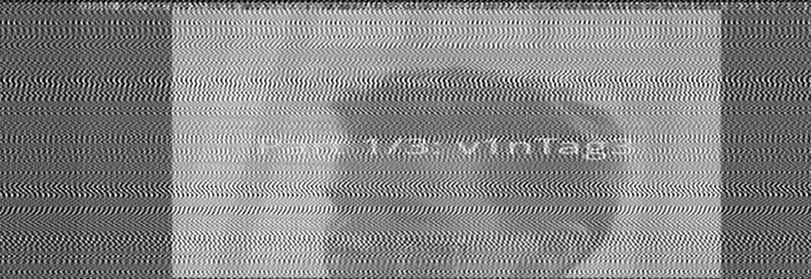

# Hack It EE34 — Nivel 6: "Classical Music" (sin resolver)

> *"Buscando en el baúl de los recuerdos me encontré este archivo en un disco duro perdido en el
> trastero, ¿qué será?"*

Este es el writeup de un reto que **no sacamos**. Fue el único punto que se nos escapó de la
edición, y lo resolvieron dos equipos en todo el concurso. Sacamos la primera de sus tres partes
—`v1nTag3`— y nos quedamos ahí después de un montón de horas.

Lo publicamos porque el decode completo es bonito y reproducible, y sobre todo porque el error que
nos costó el reto es el más instructivo que cometimos: **cerramos un negativo sin haber medido
dónde estaba la energía**, y ese negativo no solo tapó el hallazgo — **fabricó los señuelos** que
nos comieron la tarde.

---

## 1. El fichero

`classical_music.wv`: 413 MB, WavPack. La cabecera es lo primero que llama la atención:

```
magic          wvpk
total_samples  314218750
sample rate    índice 15 = "no estándar" (va en un sub-bloque)
```

El sample rate real es **31.415.926 Hz = π × 10⁷**. Eso no es un error del autor, es la firma de
que aquí hay un juego.

Consecuencia práctica inmediata: **`ffmpeg` rechaza el fichero** ("Invalid custom sample rate").
Valida los sample rates contra una lista y se planta. El decodificador de referencia, `wvunpack`,
no valida nada y lo saca sin rechistar:

```bash
# sin instalar nada en el sistema
apt-get download wavpack && dpkg-deb -x wavpack_*.deb wvpkg
wvpkg/usr/bin/wvunpack -y classical_music.wv -o out.wav
```

> **Lección barata**: si una herramienta rechaza un fichero por un campo "inválido", prueba el
> decodificador de referencia del formato antes de dar el fichero por corrupto. Y un valor raro en
> una cabecera es una **pista**, no un error.

## 2. No es audio: es una señal FM

El WAV resultante no suena a nada. Su envolvente es **plana** en todo el fichero: no hay dinámica,
llena el rango uniformemente. Eso descarta música y apunta a una señal cuya información está en la
**frecuencia instantánea**, no en la amplitud.

Demodular FM es la receta estándar: señal analítica por transformada de Hilbert, derivada de la
fase desenrollada.

```python
z    = hilbert(x)                 # por bloques, con solape
freq = np.diff(np.unwrap(np.angle(z)))
```

La portadora sale en ~0,82 rad/muestra (~4,1 MHz) y alrededor hay un mensaje suave.

## 3. La aritmética que lo delata todo

`N = 314.218.750`. Factoriza así:

```
314218750 = 2011 x 156250 = 2011 x 2 x 5^7 = 2011 x 250 x 625
```

Y con eso, a `fs = π×10⁷`:

| Magnitud | Valor medido | PAL |
|---|---|---|
| Muestras por línea | 2011 | — |
| Duración de línea | **64,012 µs** | 64 µs |
| Líneas por segundo | **15.622,0** | 15.625 |
| Líneas por cuadro | 625 | 625 |
| Cuadros | 250 | — |
| Cuadros por segundo | **24,995** | 25 |

Es **vídeo PAL**, sintetizado con precisión. Reshapeando el mensaje demodulado a ancho 2011 y alto
625, salen 250 fotogramas de 10 segundos de vídeo.

Y el vídeo es **Rick Astley, *Never Gonna Give You Up***. El reto entero es un rickroll con 413 MB
de envoltorio: te llaman "música clásica", te hacen demodular una señal analógica durante horas, y
lo que sale es pop del 87.

## 4. La parte 1: `v1nTag3`

En el frame 125 (~0:05) hay un **caption superpuesto** sobre la cara de Rick. Así sale el fotograma
en crudo, tal cual lo escupe el demodulador:



*El frame entero (2011 × 625 muestras, reescalado), por eso se ve tan achatado: cada fila es una
línea de vídeo completa, con su sync y su blanking a los lados — esas son las dos franjas oscuras
verticales. La cara de Rick se intuye en el centro. Todo el rayado diagonal es el artefacto que nos
costó la tarde, y la línea de texto tenue que lo cruza a media altura es el caption.*

Limpiando el rayado con un notch en la FFT por línea y ampliando esa banda, se lee sin ambigüedad:


*Recorte de la banda central del mismo frame, ya sin el rayado. Blanco sobre la cara:*

> **`Part 1/3: v1nTag3`**

Leet de "vintage". **Part 1/3**: la contraseña va en tres trozos, y este es el primero. Es lo único
que sacamos.

## 5. El error: "no hay audio"

Aquí es donde se perdió el reto, y merece contarse con precisión.

Buscando dónde podían estar las partes 2 y 3, se planteó la hipótesis correcta —**una subportadora
de audio**— y se buscó en **5,9 MHz** y en **3,14 MHz**, que son las bandas donde una *emisión* de
TV analógica lleva el sonido. Ambas dieron ruido. Conclusión escrita: *no hay audio; es un rickroll
solo-vídeo*.

El fallo no fue la hipótesis. Fue **no haber mirado nunca dónde estaba la energía del fichero antes
de decidir dónde buscar**. Un Welch de banda completa —64 segmentos de 1M puntos, unos segundos de
cómputo— da esto:

```
== presupuesto de energía ==
  0.000-  0.300 MHz :   0.0001 %
  0.300-  1.000 MHz :   0.0004 %
  1.000-  1.300 MHz :   0.0002 %
  1.300-  1.500 MHz :   4.2055 %     <-- aquí
  1.500-  1.700 MHz :   0.0003 %
  1.700-  1.900 MHz :   4.2056 %     <-- y aquí
  1.900-  2.500 MHz :   0.0020 %
  2.500-  3.000 MHz :   0.0041 %
  3.000-  5.500 MHz :  91.5733 %     <-- el luma
  5.500-  7.000 MHz :   0.0077 %
  7.000- 15.708 MHz :   0.0009 %

== picos sobre el suelo local ==
   1.399997 MHz   +12.4 dB
   1.800001 MHz   + 9.4 dB
```

Dos portadoras afiladísimas que se llevan **el 8,4% de todo el fichero**, y no se habían mirado
nunca. **1,400 y 1,800 MHz es exactamente el par L/R del audio VHS HiFi en PAL.** Dentro había un
canal estéreo entero, con una voz.

Nueve horas después de darlo por cerrado, el hallazgo costó **nueve minutos**.

> **Lección**: mide **dónde está la energía** antes de teorizar sobre el contenido. Un presupuesto
> espectral es el equivalente de leer el índice antes del libro: aquí, tres bandas suman el
> **99,98%** del fichero, así que en cuanto lo tienes en pantalla sabes que hay exactamente tres
> cosas dentro y dónde están.

## 6. El negativo no solo tapó: fabricó los señuelos

Esta es la parte que no habíamos visto venir y que convierte el episodio en algo más que un
descuido.

Con el audio sin detectar, sus productos de **intermodulación** con el luma quedaron sueltos por el
espectro. Con los picos medidos —luma en 4,141 MHz y HiFi L en 1,400— la diferencia cae en
`4,141 − 1,400 = 2,741 MHz`, que a 64,012 µs por línea son **175 ciclos/línea**: es el patrón de
espigas diagonales que se ve en el fotograma de arriba, y que en su día medimos como 176.

Ese patrón, tratado como señal, produjo **dos falsos positivos que costaron horas**:

- **Un "teletexto"**: promediando los 250 frames aparecía en la zona de blanking un patrón de barras
  de anchura variable, muy parecido a un *clock run-in* seguido de datos. Se decodificó con
  herramienta profesional (`vhs-teletext`, con deconvolución): **cero paquetes válidos**. La firma
  definitiva fue estadística: las longitudes de racha eran **continuas** (1,2,3,4,5…), y un código
  real tiene anchuras discretas.
- **Un "Magic Eye"**: un modelo de visión sugirió que la textura era un autoestereograma con texto
  3D. El mapa de disparidad a todas las escalas devolvía… el propio vídeo. La subportadora estaba
  modulada por el luma, así que "descodificar el estereograma" reconstruía a Rick Astley.

Los dos señuelos eran **el mismo audio no detectado**, visto de refilón.

> **Lección**: un negativo mal cerrado no es solo una pérdida. La energía que no has explicado sigue
> ahí y **reaparece disfrazada de estructura** en cualquier sitio donde mires. Si te salen patrones
> que parecen datos y ningún decoder los valida, el sospechoso número uno es algo que declaraste
> inexistente.
>
> Corolario: las IA de visión **alucinan estructura sobre texturas de ruido** con muchísima
> seguridad. Un lead de ese tipo se verifica con un decoder real antes de invertirle una hora.

## 7. Lo que sí desbloqueó: reencuadrar al formato real

El giro llegó al dejar de tratar la señal como "un PAL que se ha inventado el autor" y empezar a
tratarla como **un formato publicado**. La pista estaba en el enunciado desde el principio: "el baúl
de los recuerdos", "un disco duro perdido en el trastero". Es una **cinta**.

Midiendo el perfil de línea aparece un pulso de sincronismo de **4,7 µs** (147 de las 2011
muestras), y el luma va en FM con portadora a ~4,1 MHz. Eso no es "PAL en FM" arbitrario: es
**exactamente cómo graba el VHS PAL** (sync tip 3,8 MHz → blanco 4,8 MHz).

Y en cuanto asumes el formato, las preguntas se vuelven concretas y verificables:

- *¿Dónde llevaría el audio HiFi?* → 1,4 y 1,8 MHz. **Sí, ahí está.**
- *¿Dónde llevaría el color?* → *color-under* a 627 kHz. La banda 0,3–1,0 MHz tiene el **0,0004%**
  de la energía: **la cinta es en blanco y negro.**
- *¿Es una emisión?* → habría subportadora de sonido en 5,5 / 6,0 / 6,5 MHz. La banda 5,5–7 MHz
  tiene el 0,0077%: **no, es una grabación.**

> **Lección**: "esto es un formato inventado" es una hipótesis carísima, porque no te deja predecir
> nada. "Esto es un estándar publicado" te da una lista de sitios concretos donde mirar y te permite
> cerrar negativos **de verdad**, midiendo.

Detalle práctico de la demodulación del audio, por si alguien reproduce: los dos canales están a
solo 400 kHz uno del otro, así que hay que bajar a banda base con un **brickwall de ±245 kHz** como
mucho. Con ±491 kHz se cuela el canal vecino y contamina el resultado (nos pasó: la primera
extracción salió con la SNR arruinada y correlación espuria entre canales; con el filtro estrecho,
39 dB).

## 8. Dos técnicas que sí valieron

**Restar la obra original.** Si el material es una grabación de algo conocido, consigue el original,
alinéalo y réstalo: lo que sobreviva es lo que el autor añadió. Con un filtro de Wiener global se
cancela el **95,7%** de la música, y en el residuo aparece un único pico en el canal izquierdo —el
clip de voz— con el derecho completamente plano.

Es inmune al punto ciego de comparar L contra R, que borra cualquier cosa presente por igual en
ambos canales.

*Gotcha* que costó un rato: el offset de alineación hay que elegirlo **minimizando el residuo**, no
por el pico de correlación. La correlación daba +1099; el óptimo real era −1701 (36% de residuo
frente a 4,3%).

**Validar los detectores inyectando un positivo sintético.** Después de tres negativos seguidos, la
disciplina que adoptamos fue: antes de creerse que un detector no encuentra nada, **fabricar el
positivo e inyectarlo**. Un caption sintético de un solo frame, con el contraste real, tiene que
salir el primero de la lista; si no sale, el detector no vale y su negativo no dice nada.

Tres detectores seguidos resultaron inválidos con esa prueba. Uno de ellos, el diff contra el vídeo
original, fallaba por una escala vertical mal asumida (1,208 en vez de 1,2529); corregida, el
instrumento pasó su gate de calibración y **entonces** su negativo empezó a significar algo.

> **Lección**: un instrumento que no has validado contra un positivo conocido no produce evidencia
> de nada, y mucho menos evidencia negativa. "No calibra" ≠ "no hay nada".

## 9. Lo que quedó abierto

Con el instrumental ya validado, el fichero quedó **medido y cerrado**: el presupuesto espectral
explica el 99,98% de la energía en tres portadoras, y hay exactamente **dos payloads** del autor.

- **Parte 1/3 = `v1nTag3`**, el caption del vídeo. Firme.
- **Parte 2/3**: casi con seguridad la **palabra hablada** del canal izquierdo. El autor no la mezcló
  con la música: **vació el canal** durante 640 ms y metió un clip de TTS limpio con padding de
  silencio. Y ahí nos quedamos: el clip dura 273 ms, tiene **un solo núcleo vocálico** y el análisis
  de formantes (F1≈399, F2≈952, caída de F3 típica de la /r/ inglesa, con burst de oclusiva sorda al
  inicio) apunta a **`/tɹoʊl/` — "troll"**, no a "rickroll". Aun aceptando la palabra, quedaba el
  problema real: **una voz no dicta ortografía**, y `v1nTag3` solo atestigua las sustituciones i→1 y
  e→3, no o→0.
- **Parte 3/3**: **nunca supimos dónde estaba.** El fichero no contiene una tercera cosa; con el
  presupuesto espectral cerrado, la parte 3 vive fuera del artefacto y no dedujimos dónde.

Nota de honestidad sobre esta sección: los puntos de la parte 2 (fonética, canal vaciado, resta del
original) provienen de nuestro análisis de aquellas sesiones y **no los hemos vuelto a ejecutar**
para este writeup. Lo que sí está re-verificado aquí, ejecutándolo de nuevo, es todo lo demás: la
cabecera WavPack, la aritmética PAL, el presupuesto espectral con sus dos portadoras, y el caption.

## 10. Reproducir

```bash
wvpkg/usr/bin/wvunpack -y classical_music.wv -o out.wav   # ffmpeg lo rechaza
python3 spectrum_budget.py                                # el presupuesto de energía
```

```python
# demod FM -> vídeo PAL
z    = hilbert(x)                          # por bloques con solape
msg  = np.diff(np.unwrap(np.angle(z)))
cube = msg[:250*625*2011].reshape(250, 625, 2011)   # 250 frames PAL
```

El directorio trae ~60 scripts, cada uno con su hipótesis en el docstring y su gate de validación;
`README.md` es el índice. Los `.npy` intermedios son regenerables y pesan más de 1 GB cada uno.

## 11. Lo que nos llevamos

1. **Mide dónde está la energía antes de teorizar sobre el contenido.** Un presupuesto espectral que
   cierra al 99,98% te dice cuántas cosas hay dentro del fichero y dónde. Es de lo más barato que
   puedes hacer y lo hicimos tardísimo.
2. **Un negativo mal cerrado fabrica señuelos.** La energía no explicada reaparece disfrazada de
   estructura. Dos falsos positivos que costaron una tarde eran el mismo audio que habíamos
   declarado inexistente.
3. **Reencuadra al formato real.** "Es un estándar publicado" es una hipótesis productiva: te da
   sitios concretos donde mirar. "Se lo ha inventado el autor" no predice nada.
4. **Si el material es una obra conocida, consigue el original y réstalo.** Lo que sobrevive es lo
   que añadió el autor.
5. **Valida los detectores con un positivo sintético inyectado.** Sin eso, un negativo no es
   evidencia.
6. **El enunciado es data.** "El baúl de los recuerdos", "el trastero": el reto te estaba diciendo
   *cinta* desde la primera línea, y estuvimos horas tratando la señal como un formato inventado.

Sobre el proceso: este reto se atacó con asistencia de IA, y es el que peor salió — pero el patrón
del fallo no es "no supo": el análisis de señal fue competente y el instrumental que quedó es
sólido. Lo que falló fue de método, y dos veces en el mismo sitio: **cerrar como hecho un negativo
que ningún experimento había puesto a prueba**, primero con el audio y luego con los detectores de
caption. Cuando la corrección llegó —relanzando el análisis en frío, sin heredar el marco "aquí no
hay audio"— el hallazgo tardó minutos.

No sacamos el punto. Pero de los trece niveles de la edición, es del que más aprendimos.
