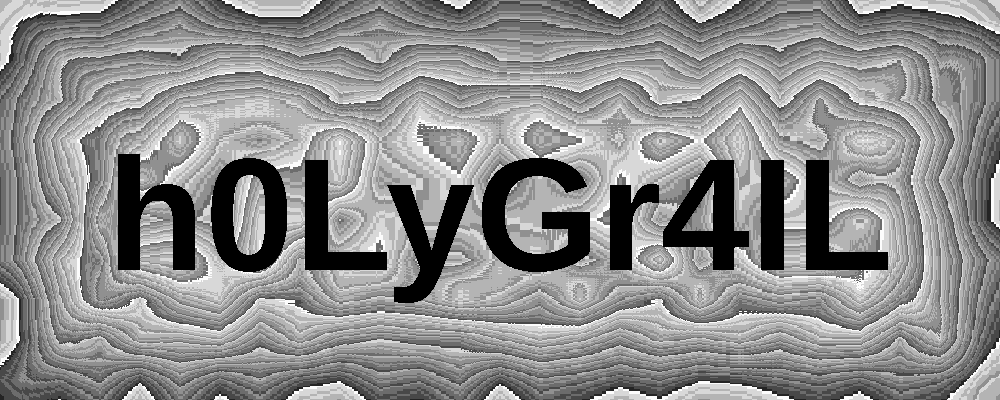
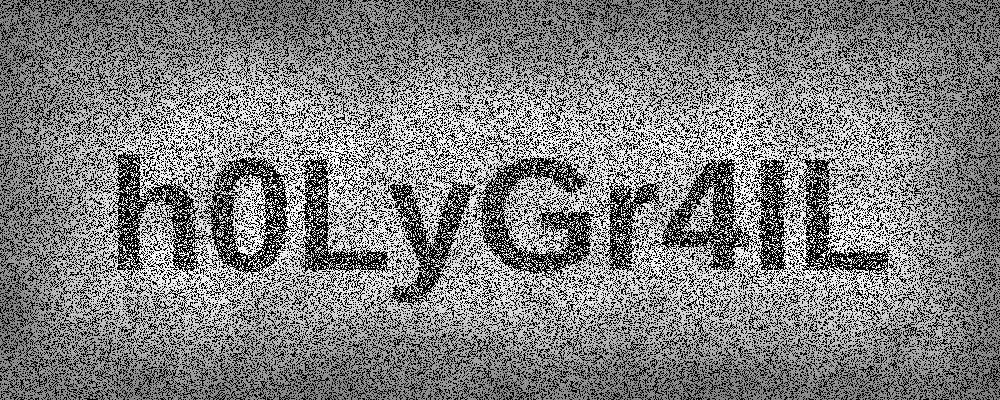

# Solve It EE34 — Nivel 6: "The Last Crusade"

> *"Indy está buscando el Santo Grial pero anda muy perdido. ¿Estás dispuesto a hincar el
> **diente** a esta aventura y ayudarle?*
>
> *El padre de Indiana le ha enviado el siguiente telegrama:*
>
> ***EL PRIMER ARTEFACTO LO PUEDES ENCONTRAR CERCA DE LA FUENTE DE TUS FRUSTRACIONES. PRESTA
> ATENCIÓN Y LO ENCONTRARÁS. ESTAREMOS EN CONTACTO.***
>
> ***NOTA: cambio de estilo***"

Este no se resuelve desde el teclado. Es un **treasure hunt físico** por el recinto de la party,
con balizas **Bluetooth Low Energy** escondidas por el autor.

La contraseña es **`h0LyGr4IL`** ("Holy Grail" en leet), y está escondida en las imágenes de
ruido que sueltan las balizas: se recupera **XOR-eando las cinco a la vez**, recortando antes la
banda del rótulo. Reproducible en diez líneas, sección 4.

El reto tiene **dos canales distintos** sobre el mismo PNG, y confundirlos nos costó dos
diagnósticos equivocados en direcciones opuestas: un **rótulo de texto impreso a la vista** con
la ruta física, y un **payload oculto en el campo de ruido** con la respuesta. Las dos cosas son
ciertas a la vez. Lo contamos entero, incluidos los dos errores.

---

## 1. El telegrama: leer el enunciado como instrucciones

El enunciado no es ambientación, es el manual de operaciones. Tres señales:

- **"hincar el diente"**, con *diente* resaltado **en azul** en la página. Diente azul =
  **Bluetooth** (el logo es una runa del rey Harald *Blåtand*, "diente azul"). Ahí está el canal.
- **"CERCA DE LA FUENTE DE TUS FRUSTRACIONES"** — la primera baliza está físicamente cerca de un
  sitio concreto del recinto. Es una pista de ubicación, no un acertijo.
- **"ESTAREMOS EN CONTACTO"** — habrá más de una, encadenadas.

Y una nota final, **"NOTA: cambio de estilo"**, que volveremos a mirar en la sección 5 porque
sigue sin explicación.

## 2. Las balizas

Escaneando BLE en el recinto aparece una familia de dispositivos con una firma común:

- OUI **`A0:F2:62`** (fabricante del ESP32),
- ServiceData bajo el UUID **`0x4242`**,
- nombres de localizaciones de *Indiana Jones y la última cruzada*: **Venezia**, **Brunwald**,
  **Brody**, **Iskenderun**…

El ServiceData de cada baliza es ASCII plano: un **tinyurl**.

```
name=Venezia    uuid=00004242-...   ascii=tinyurl.com/4vt9d7ut
name=Brunwald   uuid=00004242-...   ascii=tinyurl.com/4zykhx5eD
```

Cada URL corta lleva a un **PNG de "estática de televisión"** con un **rótulo de texto negro
sobre blanco en la parte superior** — y ese rótulo es la pista que te manda a la siguiente
ubicación física. Los cuatro que capturamos:

| Imagen | Rótulo |
|---|---|
| `artefacto2.png` | *"Bizkaia quiere darse a conocer y ha robado el artefacto"* |
| `artefacto3.png` | *"Indiana se ha olvidado el diario de su padre junto a un montón de componentes electrónicos"* |
| `artefacto4.png` | *"El Doctor Brody ha llamado por teléfono y nos ha pedido que vayamos a rescatarle"* |
| `artefacto5.png` | *"Hemos oído que los nazis quieren boicotear la charla de resolución del Hack-It/Solve-It"* |
| `artefacto6.png` | *(sin rótulo — es la imagen **jammeada**, 400 px en vez de 542)* |

Cada frase apunta a una zona del recinto (la zona de componentes electrónicos, la sala de la
charla…) donde está la siguiente baliza. El rally es: Venezia → Brunwald → Brody → Iskenderun,
y la última llega **interferida**, como el castillo del grial en la peli.

### Detalle técnico que ahorra una hora: capturar BLE por callback

`bluetoothctl info <MAC>` **cachea el último advertisement** que vio del dispositivo. Si la
baliza alterna payloads, el cache te miente: siempre te devuelve el mismo. Hay que capturar
**por frame**, con un callback (`bleak` en Python) o `btmon`.

Nuestros monitores (`monitor_brunwald.py`, `monitor_next.py`, `capture_chars.py`) hacen eso:
escanean, filtran por UUID `0x4242` y registran cada payload nuevo con su MAC.

## 3. La corrección: los rótulos NO estaban ocultos

Aquí va la parte incómoda, y es la razón principal por la que este writeup se ha reescrito.

En la primera versión publicamos que las imágenes eran ruido gris sin nada visible, que
comparten una base de ruido, y que **XOR-earlas entre sí "revelaba" los rótulos**. Lo segundo es
cierto. Lo primero y lo tercero son **falsos**.

Los rótulos **están impresos en negro sobre blanco en la parte superior de cada PNG, a plena
vista**. No hay nada oculto. Cuando XOR-eas dos imágenes, la banda del rótulo (blanca en ambas)
se cancela y quedan marcados los píxeles de las letras — de las dos imágenes a la vez,
superpuestas. Es decir: **veíamos en el resultado del XOR un texto que ya estaba impreso en la
entrada**. La verificación era circular, y encima el "texto revelado" que publicamos era una
frase que no existe: el final del rótulo de `artefacto2` empalmado con la cola del de
`artefacto3`.

El error de método, que es el que vale la pena llevarse:

> **Antes de afirmar que un tratamiento revela algo, mira el original.** Un pipeline que
> "descubre" contenido que ya estaba en la entrada no ha descubierto nada, y el modo de fallo
> es especialmente traicionero cuando el tratamiento produce una imagen distinta a la vista
> (aquí, texto blanco sobre negro en vez de negro sobre blanco): parece un hallazgo porque *se
> ve diferente*.

### Lo que sí es cierto y medible: comparten base de ruido

Esto se sostiene. Dos imágenes de ruido independiente coinciden byte a byte con probabilidad
igual a la colisión de sus histogramas; **para estas imágenes concretas eso es ≈20,3%**. Lo
medido:

```
coincidencia byte a byte entre pares (imagen completa):  60,8%
esperado si fueran independientes (histogramas reales):  20,3%
```

Tres veces la tasa de azar: el campo de ruido **no es independiente entre imágenes**, hay un
generador base compartido. (Ojo con la cifra de manual "1/256 ≈ 0,4%": solo vale para bytes
uniformes, y estos no lo son. Usa el histograma real.)

Además, la imagen jammeada de 400 px **encaja con las otras a partir de la fila 142** — el mismo
punto donde acaba la banda del rótulo en las de 542 px. O sea que es el mismo lienzo de ruido,
recortado.

Esa base compartida no sirve para revelar los rótulos —que ya se ven— pero es **exactamente el
mecanismo del reto**, como se ve en la sección siguiente.

## 4. El mecanismo real: XOR de las CINCO, recortando el rótulo

El campo de ruido **sí esconde la contraseña**. Hacen falta **dos** condiciones a la vez, y por
eso ninguna prueba parcial la encuentra:

1. **Las cinco imágenes juntas**, incluida la jammeada. Los XOR **por pares** dan ruido puro
   (medido: desviación por bloques 8×8 = 0,062, exactamente el nulo binomial `√(0,25/64) =
   0,0625`). El payload solo emerge en el acumulado de las cinco.
2. **Recortando la banda del rótulo.** El campo de ruido empieza en la **fila 142**; las filas
   0-141 son el rótulo impreso. Si dejas la banda dentro, el XOR se llena del texto visible y del
   escalón blanco/ruido, y tapa lo que importa.

```python
from PIL import Image
import numpy as np, functools

names = ['artefacto2.png','artefacto3.png','artefacto4.png','artefacto5.png','artefacto6.png']
ims   = [np.array(Image.open(n).convert('L')) for n in names]
# el campo de ruido: fila 142..542 en las de 542 px, 0..400 en la jammeada
crops = [(a[142:542,:1000] if a.shape[0] > 500 else a[0:400,:1000]).astype(np.uint8) for a in ims]

x5 = functools.reduce(lambda a, b: a ^ b, crops)
pc = np.unpackbits(x5.reshape(-1,1), axis=1).sum(axis=1).reshape(x5.shape)   # popcount por byte
Image.fromarray((pc * 36).astype('uint8')).save('solucion.png')
```



La contraseña sale en letras negras enormes sobre el residuo del ruido. El popcount medio es
**3,90** sobre un rango 0-7 — o sea, ruido equilibrado en el fondo — y las letras caen donde el
XOR se anula.

No hace falta ser fino con el realce: también sale con la **mediana** de las cinco, con más
grano; se intuye con la suma módulo 256; y aparece nítida quedándose solo con el **bit bajo**
(`x5 & 1`).



Y ahora la estadística de la sección 3 encaja: la base de ruido compartida (60,8% frente al
20,3% de azar) **es justo lo que hace que el XOR cancele el fondo** y deje en pie lo que el autor
escribió encima. Los dos hechos que parecían pelearse eran el mismo diseño.

### Por qué nuestros negativos anteriores eran correctos y aun así no valían

Merece la pena, porque el error tiene forma reutilizable:

- *"Los XOR por pares no tienen estructura"* — **cierto**, y bien medido contra su nulo. Pero el
  payload no está en ningún par: está en las cinco.
- *"La jammeada no esconde texto por sí sola"* — **cierto** también. Su única estructura propia
  es una viñeta de luminancia. Pero es que no era la portadora: es **una de las cinco capas**, y
  sin ella el XOR no cierra.

Es decir: dos negativos correctos, bien instrumentados… **sobre subconjuntos del problema**. Un
negativo solo cubre lo que probaste, y probar 10 pares no es probar la combinación de 5. Cerrar
el frente con eso es un negativo mal cerrado — el mismo pecado que denunciamos en la sección 3,
esta vez en la dirección contraria: allí vimos de más, aquí vimos de menos.

## 5. Un cabo suelto declarado como tal: "cambio de estilo"

Algunos payloads BLE llegaban con un **carácter extra** al final del tinyurl (`tinyurl.com/
4zykhx5e` + `D`, `4zcrcvek` + `R`, `2dt4387w` + `f`, `mru9k4tb` + `T`…). Los ocho caracteres del
código corto son la URL; el noveno sobra.

En su día intentamos leerlos como un canal secundario y forzamos una palabra temática con ellos
— eso sí era apofenia y lo descartamos. **Pero descartar la lectura no es descartar el canal**,
y aquí nos pasamos de frenada: el enunciado termina con **"NOTA: cambio de estilo"**, una
indicación explícita del autor que no encaja con nada de lo que sí explicamos. Y los caracteres
extra tienen precisamente **mezcla de mayúsculas y minúsculas** (`D`, `R`, `f`, `T`), que es lo
que uno esperaría de una pista sobre "estilo" — igual que la contraseña, que alterna cajas
(`h0LyGr4IL`).

**Queda sin resolver**, y lo marcamos así en vez de darlo por cerrado. Es el fallo que el resto
de esta serie de writeups denuncia una y otra vez: convertir "no supe leerlo" en "no era nada".

## Reproducir

Las cinco imágenes están en este mismo directorio del repo (`artefacto2.png`..`artefacto6.png`),
así que todo lo de arriba se puede correr tal cual: el snippet de la sección 4 funciona copiado
literalmente, y los rótulos se leen **abriendo los ficheros**.

El test de base compartida, con la baseline correcta:

```python
from PIL import Image
import numpy as np, itertools

names = ['artefacto2.png', 'artefacto3.png', 'artefacto4.png', 'artefacto5.png']
A = {n: np.array(Image.open(n)) for n in names}

for x, y in itertools.combinations(names, 2):
    a, b = A[x].ravel(), A[y].ravel()
    px = np.bincount(a, minlength=256) / a.size
    py = np.bincount(b, minlength=256) / b.size
    print(x, y, 'obs=%.4f  esperado=%.4f' % ((a == b).mean(), (px * py).sum()))
    # -> obs ~0.608 frente a ~0.203 esperado: base de ruido compartida
```

Y el negativo de los pares, con su nulo, para que se vea que probar subconjuntos no cierra nada:

```python
def blockavg(m, k=8):
    h, w = m.shape; h2, w2 = h//k*k, w//k*k
    return m[:h2, :w2].reshape(h2//k, k, w2//k, k).mean((1, 3))

d = (A['artefacto2.png'][142:] != A['artefacto3.png'][142:]).astype(float)
print(blockavg(d, 8).std(), (0.25/64)**0.5)   # 0.0628 vs 0.0625 -> por pares, ruido puro
```

Para las balizas, cualquier scanner BLE que capture **por frame** (no `bluetoothctl info`):
filtrar ServiceData bajo UUID `0x4242`, leer el tinyurl y seguir la ruta física.

## Lo que nos llevamos

1. **N imágenes de ruido con base compartida ⇒ combínalas TODAS, y recorta antes lo que no sea
   ruido.** Las dos mitades importan: por pares no sale nada, y con la banda del rótulo dentro
   tampoco. La versión ingenua de la regla ("XOR entre ellas") no habría resuelto este reto.
2. **Un negativo solo cubre lo que probaste.** Nuestros dos negativos —pares sin estructura,
   jammeada sin texto— estaban bien medidos contra su nulo y aun así no cerraban el frente,
   porque el payload vivía en una combinación que no habíamos probado. "Probé 10 pares" no es
   "probé las combinaciones".
3. **Antes de afirmar que un tratamiento revela algo, abre el original.** El primer XOR
   "descubrió" un texto que estaba impreso a la vista. Verificación circular, difícil de detectar
   porque el resultado *se veía distinto* (blanco sobre negro en vez de negro sobre blanco).
4. **La baseline de una prueba estadística se calcula con los datos, no de memoria.** El "1/256"
   de manual habría hecho pasar por espectacular (150×) algo que es 3×. Los histogramas reales
   dan ≈20,3%.
5. **Descartar una lectura no es descartar el canal.** Los caracteres extra de los
   advertisements no deletreaban lo que quisimos leer, pero el enunciado dice "cambio de estilo"
   y eso sigue sin explicación. Se marca abierto.
6. **Lee el enunciado como instrucciones.** *diente* en azul = Bluetooth, "fuente de tus
   frustraciones" = ubicación física, "estaremos en contacto" = cadena. Medio reto está ahí.

Sobre el proceso: la cadena de balizas y el pipeline BLE los montamos con asistencia de IA, y esa
parte funcionó. La de las imágenes es un caso de estudio de cómo se puede fallar dos veces
seguidas en direcciones opuestas sobre el mismo dato.

**Primero por exceso.** La máquina hizo una batería forense por-imagen, la declaró vacía, y
cuando el humano sugirió *"quizás algo como superponer las imágenes, invertir colores, o algo
así"*, tradujo esa intuición a "XOR", lo ejecutó sobre **dos** imágenes, vio texto y lo cantó como
hallazgo — sin abrir un solo PNG original para comprobar que ese texto ya estaba impreso. Eso se
publicó, y sobrevivió a una revisión más porque quien la hizo tampoco abrió la imagen.

**Después por defecto.** Al destaparse la circularidad, se rehízo el análisis con rigor: negativos
bien instrumentados, contrastados contra su nulo binomial, correctamente medidos… y se concluyó
que no sabíamos de dónde salía la contraseña. También publicado. También falso: el rigor se había
aplicado a **subconjuntos** del problema.

Lo que cerró el reto no fue ninguna de las dos pasadas, sino **la memoria del humano**, que
recordó las dos condiciones exactas — *todas las imágenes juntas, y sin la banda del texto* —
después de que dos análisis hubieran cerrado el frente en falso. La lección no es "confía en el
humano": es que **un frente cerrado con un negativo correcto sigue siendo un frente cerrado en
falso si el negativo no cubre el espacio entero**, y que quien tiene el recuerdo de cómo se hizo
algo aporta más que quien tiene el mejor instrumento para medirlo.
